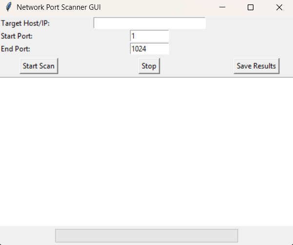
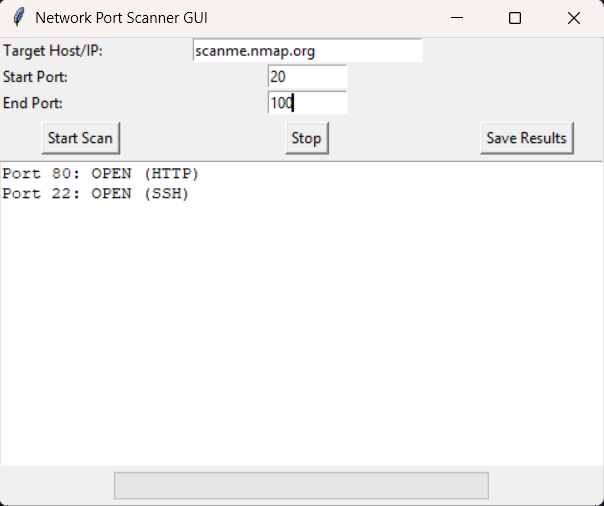

# Network Port Scanner GUI

A lightweight TCP port scanner with a graphical user interface built using Python and Tkinter.  
This project was created as part of an internship to demonstrate practical networking and cybersecurity skills.

---

## ✨ Features
- Enter target host, start port, and end port
- Multi-threaded scanning for fast results
- Real-time progress bar
- Service identification for common ports
- Save results to a text file
- Cross-platform (Windows, macOS, Linux)

---

## 🛠 Requirements
- Python 3.7+
- Tkinter (included with Python)

---

## 🚀 Usage
Run the program from your project folder:
```bash
python portscanergui.py
```
---

## 📸 Screenshots  

### GUI Interface  
  

### Scan Results  
  

---

## 📊 Example Output File

Here is a sample saved results file (`scan_results.txt`):
Port 22 is open Port 80 is open

---

## ⚠️ Disclaimer  
Use this tool only on networks you own or have explicit permission to scan.  
Unauthorized scanning may violate laws or organizational policies.


